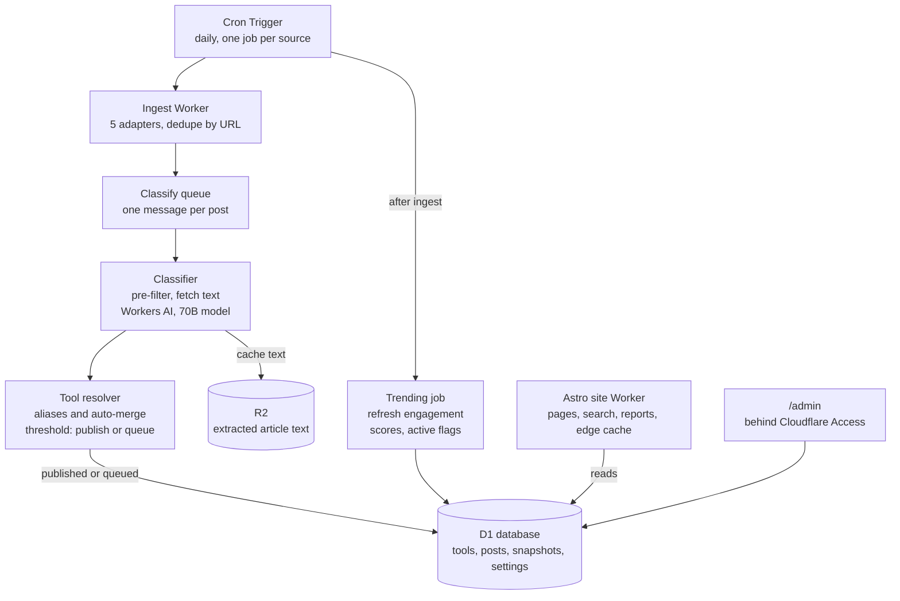

# AI Coding Tools Radar — Design Doc

As of Oct 3, 2026

## Overview

A public website that discovers new AI coding tools daily from developer communities and ranks them by what is trending. It runs entirely on Cloudflare, with a target cost of $1–2 per day. "AI Coding Tools Radar" is a working title.

**In scope:** developer tools that use AI to help write, run or manage code. This means coding agents, AI IDEs and editor extensions, CLIs, and MCP servers. Both open-source and closed-source tools are included; closed-source tools are flagged as such.

**Out of scope:**

- SDKs and libraries for building LLM apps
- Models, papers, benchmarks and general AI news
- Roundups, comparisons and "awesome-X" lists (dropped entirely)
- User accounts, user submissions, email digests, RSS and site analytics (not in v1)

**Key product decisions:**

| Decision | Choice |
| --- | --- |
| Audience | Public, anyone can browse |
| Unit of content | Tool pages, each with a timeline of linked posts |
| Home page | Trending tools |
| Freshness | One batch run per day |
| Inclusion bar | Everything that qualifies, no minimum traction |
| Review | Queue built in; a confidence threshold controls auto-publishing |
| Classifier | Workers AI open models only |
| Categories | Fixed list controlled by the admin |
| Backfill at launch | 90 days |
| Environments | Production only |
| Public visitor features | Search, filters, and a "report this" link |

## Architecture

The system is two Workers that share one D1 database. An ingestion Worker writes once a day, and the Astro site Worker reads.



Only the classifier step costs meaningful money. The site never calls Workers AI, so traffic spikes do not raise AI costs.

## Sources and ingestion

Each source is a small adapter that returns normalized posts. A daily Cron Trigger enqueues one fetch job per source, so a broken source never blocks the others.

| Source | Method | Native signals | 90-day backfill |
| --- | --- | --- | --- |
| Hacker News | Algolia API, filtered by date | Points, comments, Show HN tag | Full |
| lobste.rs | `/newest.json`, paginated | Score, comments, tags such as `ai` | Full |
| Reddit | OAuth API, subreddit listings | Upvotes, comments, flair | Partial: listings stop at about 1,000 posts |
| GitHub | Search API for repos created recently with topics such as `mcp` or `ai-agent`; Trending page scraped | Stars, language, license, topics | Search only; Trending has no history |
| Product Hunt | GraphQL API with token | Votes, comments, topics | Full via date filter |

Every adapter emits the same shape: source, external ID, URL, title, author, posted time, score and comment count. Dedupe happens before classification, using the canonical URL. A GitHub URL is reduced to `owner/repo`.

**Engagement refresh:** each daily run also re-fetches scores and comments for posts linked to active tools. It writes a snapshot row, so trending can measure growth.

**Backfill:** a one-off job runs the same adapters over 90-day date windows, pushing into the same queue. All backfilled items go to the review queue (threshold set to 1) so classifier quality can be checked before anything is public.

**Product Hunt terms:** the API terms restrict commercial use. Confirm a public site is allowed before relying on it.

## Extraction and classification

Every new post passes through three stages. Each post is its own queue message, which keeps every invocation well inside Worker CPU limits and gives free retries.

1. **Pre-filter (no AI).** Score the title, URL and domain against a keyword list (`llm`, `agent`, `mcp`, `copilot`, `claude`, `cursor`, `codegen` and so on). GitHub links, Show HN and lobste.rs `ai` tags add points. Posts scoring zero are dropped and logged. The keyword list lives in settings.
2. **Content fetch.** For GitHub links, fetch the README through the API. Otherwise fetch the page and extract the main text with Mozilla Readability and `linkedom`. JS-heavy pages fall back to Browser Rendering. Text is truncated to about 3,000 tokens and cached in R2 so posts can be reclassified later without re-fetching.
3. **LLM classification.** One Workers AI call per post, using a 70B-class instruct model such as Llama 3.3 70B. The prompt contains the scope definition, the fixed category list as an enum, and the curated few-shot examples (capped at 20).

The model must return JSON in this shape:

```json
{
  "is_ai_dev_tool": true,
  "post_type": "launch | release | discussion | roundup | news",
  "tool_name": "string",
  "homepage_url": "string | null",
  "github_repo": "owner/repo | null",
  "version": "string | null",
  "category": "agent | ide | cli | mcp-server | other",
  "tags": ["string"],
  "is_open_source": true,
  "description": "one line, under 140 characters",
  "confidence": 0.0
}
```

**Routing after classification:**

- `is_ai_dev_tool` false, or `post_type` roundup: dropped, with the reason stored.
- `confidence` at or above the review threshold: auto-published.
- Below the threshold: sent to the review queue.
- `category` of `other`: always queued, as a signal that the category list may need to grow.

**Validation:** the Worker parses and checks the JSON against the schema. An invalid response is retried once, then queued for review with the raw output attached.

## Tool identity and merging

Every classified post resolves to exactly one tool. The resolver matches identifiers from strongest to weakest and stops at the first hit.

1. GitHub `owner/repo`, normalized to lowercase.
2. Homepage domain, ignoring generic hosts such as `github.io`, `vercel.app` or `medium.com`, which fall through to the next step.
3. Normalized name: lowercase, with spaces, hyphens and suffixes like "AI" or "CLI" stripped. A fuzzy match (similarity of 0.9 or higher) auto-merges.
4. No match: a new tool is created.

Each identifier that matched or was newly seen is stored in `tool_aliases`. A tool can therefore pick up new names, domains and repos over time.

**Admin merge and split:** auto-merge is allowed to be wrong because every merge is reversible. Each merge writes a `tool_merges` row listing which aliases and posts moved. Splitting a merge restores them. The admin can also move a single post to a different tool.

**Releases:** a post with `post_type` release and a `version` attaches to its tool as a release event on the timeline. It also counts as a post for trending. If the tool is new, it is created from the release post.

## Trending score and activity

Trending is recomputed once per day after ingestion, as an engagement score divided by an age penalty. All weights and the gravity exponent live in settings, so they can be tuned without a deploy.

```
score = (w_s * S + w_e * ln(1 + P + 2C) + w_g * ln(1 + stars_gained_7d)) / (h + 2)^g
```

| Term | Meaning | Starting value |
| --- | --- | --- |
| S | Distinct sources with a post about the tool in the last 14 days | — |
| P, C | Total upvotes and comments across those posts | — |
| stars_gained_7d | Stars gained in the last 7 days (0 for closed-source tools) | — |
| h | Hours since the tool's most recent post | — |
| w_s | Source weight | 3.0 |
| w_e | Engagement weight | 1.0 |
| w_g | Star growth weight | 1.5 |
| g | Gravity exponent | 1.5 |

The starting values are guesses to tune against the backfilled data. Closed-source tools have no star term, so their score leans on posts and engagement.

**Active tools:** a tool is active if it had a post or release in the last 30 days, or gained stars compared with a week earlier. Only active tools get their posts' engagement and their GitHub stats refreshed. A new post reactivates a tool automatically.

**Backfill gap:** star growth is unknown for the 90 backfilled days, because snapshots only start at launch. Trending relies on posts and engagement until a week of snapshots exists.

## Data model

All state lives in one D1 database. Extracted article text is stored in R2, keyed by post ID, and is not kept in D1.

| Table | Holds | Key columns |
| --- | --- | --- |
| `tools` | One row per tool | id, slug, name, description, category, tags (JSON), homepage_url, github_repo, is_open_source, status (published, queued, hidden), is_active, trending_score, first_seen_at, last_post_at |
| `tool_aliases` | Names, domains and repos that resolve to a tool | tool_id, kind (repo, domain, name), value (unique per kind) |
| `tool_merges` | Merge log, used to undo merges | id, from_tool_id, into_tool_id, moved_aliases (JSON), moved_posts (JSON), merged_at, undone_at |
| `posts` | One row per submission | id, source, external_id, url, canonical_url, title, author, posted_at, tool_id, post_type, version, classification (JSON), confidence, status (published, queued, rejected, dropped), drop_reason |
| `post_snapshots` | Daily engagement per post | post_id, date, score, comments |
| `repo_snapshots` | Daily GitHub stats per tool | tool_id, date, stars, forks, language, license |
| `review_decisions` | Every approve, reject or edit made in the queue | post_id, decision, corrected_fields (JSON), use_in_prompt, decided_at |
| `reports` | Visitor reports from tool pages | id, tool_id, reason, note, created_at, resolved_at |
| `source_runs` | One row per source per run, for the status panel | source, started_at, finished_at, items_fetched, error |
| `settings` | Tunable values as JSON | key, value |

**Settings keys:** `review_threshold`, `trending_weights`, `categories`, `prefilter_keywords`, `model_id` and `max_fewshot`.

**Search:** a D1 FTS5 virtual table indexes tool name, description and tags. It is kept in sync with triggers on `tools`.

## Frontend

The site is Astro with the Cloudflare adapter, deployed as a Worker with static assets. Pages are server-rendered from D1 and cached at the edge, with the cache cleared after each daily run. That keeps pages fast and indexable without a rebuild per day.

| Route | Content |
| --- | --- |
| `/` | Trending tools: name, one-line description, category, open or closed badge, stars, post count, latest activity |
| `/new` | Newest tools by first-seen date |
| `/tools/[slug]` | Tool page: description, category and tags, homepage and GitHub links, GitHub stats (stars, license, language), and a timeline of posts and releases, newest first, with a "report this" link |
| `/category/[name]` | Trending within one category |
| `/search` | Full-text search with filters |
| `/api/*` | JSON endpoints for search, filters and reports |
| `/admin/*` | Review queue, tools, settings, reports and status panel |

**Search and filters:** text query, category, open or closed, language, star range and first-seen date range. The filter state lives in the URL, so results can be shared and indexed.

**Reports:** a small form with a reason (not an AI coding tool, wrong merge, spam, broken link) and an optional note. It is rate-limited per IP with Cloudflare's rate limiting binding, and Turnstile blocks bots.

Public pages do not show confidence or whether an entry was auto-classified.

## Review queue, settings and feedback

One setting controls how automatic the site is: `review_threshold`. Posts with confidence at or above it publish automatically; the rest wait in the queue.

| Threshold | Behavior |
| --- | --- |
| 0 | Fully automatic; the queue only holds invalid outputs and `other` categories |
| 0.7–0.9 | Confident items publish; borderline items wait for review |
| 1 | Everything is reviewed (used for the backfill) |

**Admin pages** sit behind Cloudflare Access, so there is no login code to write.

- **Queue:** each item shows the title, source, extracted text preview and the model's JSON. Actions are approve, reject, edit fields, or reassign to a different tool.
- **Tools:** edit tool details, merge two tools, split a past merge, hide a tool.
- **Settings:** threshold, trending weights, category list, pre-filter keywords and model ID.
- **Reports:** open visitor reports with links to the tool, and a resolve button.
- **Status panel:** last run per source, item count, error, and a warning when a source's count drops sharply below its 7-day average.

**Feedback loop:** every queue decision is stored in `review_decisions`. A checkbox marks a decision as a few-shot example. Only marked rows, up to `max_fewshot`, go into the classifier prompt. A "reclassify" button re-runs the classifier over cached R2 text after the prompt or examples change.

## Operations, cost and launch

Expected daily cost is under $1, inside the $1–2 target, assuming about 300 posts pass the pre-filter each day.

| Item | Assumption | Approx. cost per day |
| --- | --- | --- |
| Classification input | 300 posts × 6,000 tokens (text plus prompt and few-shot examples) at about $0.29 per million | $0.53 |
| Classification output | 300 × 200 tokens at about $2.25 per million | $0.14 |
| Workers, Queues, D1, R2 | Workers Paid plan, $5 per month, usage well within its allowances | $0.17 |
| **Total** | | **about $0.84** |

Model prices are approximate, taken from third-party trackers, and should be confirmed on Cloudflare's model pages. The 90-day backfill is a one-off cost of roughly 90 days of classification, so on the order of $40–60. If that is too much, it can run on a smaller model and only the borderline items be re-checked with the 70B model.

**Deploy:** GitHub Actions on GitHub-hosted runners with `cloudflare/wrangler-action`. On push to `main`, it runs type checks and tests, applies D1 migrations, then deploys. The API token and Reddit, GitHub and Product Hunt credentials are kept in repo secrets and Worker secrets.

**Monitoring:** the admin status panel only, as decided. Each run writes `source_runs`, and the panel flags errors and sudden drops in item counts.

**Launch plan:**

1. Scaffold the repo: Astro site, ingestion Worker, D1 schema and migrations, CI.
2. Build the HN and lobste.rs adapters plus classification, then test on a week of data.
3. Add Reddit, GitHub and Product Hunt adapters.
4. Run the 90-day backfill with the threshold at 1 and review the queue.
5. Tune the prompt, few-shot examples, category list and trending weights against the backfill.
6. Lower the threshold and make the site public.

**Open questions:**

- Site name and domain.
- Which subreddits to watch beyond r/LocalLLaMA and r/ChatGPTCoding.
- The starting category list beyond agent, IDE, CLI and MCP server.
- Whether Product Hunt's API terms allow use on a public site.
- Backfill model: the 70B model throughout, or a smaller model with 70B re-checks.

## Phone-only workflow

All development and operations happen from a phone, so nothing may require a local machine. Claude Code (from the Claude mobile app) writes code and opens PRs; GitHub Actions runs every command that would normally run locally.

| Workflow | Trigger | Does |
| --- | --- | --- |
| `bootstrap.yml` | Manual, run once | Creates the D1 database, R2 bucket and queues with Wrangler, then commits their IDs into `wrangler.jsonc` |
| `ci.yml` | Pull request | Type checks, unit tests, migration dry run |
| `deploy.yml` | Push to `main` | Applies D1 migrations, then deploys both Workers |
| `ops.yml` | Manual, with inputs | Runs one action: apply migrations, run a read-only SQL query, set a Worker secret, start the backfill, or trigger one source now |

**Setup done in a phone browser:** the Cloudflare API token, Cloudflare Access for `/admin`, GitHub repo secrets, and the Reddit OAuth app. The GitHub app cannot manage secrets, so use the browser in desktop-site mode.

**Debugging:** Workers Logs is enabled through `observability` in the Wrangler config, so logs are searchable in the Cloudflare dashboard. The admin status panel adds a "run now" button per source, and each queue item shows its raw extracted text and model output. The D1 console in the dashboard covers ad hoc queries.

**Admin UI is mobile-first:** one queue item per screen, large approve and reject buttons, and no actions that need a keyboard.

**Work in small PRs:** each Claude Code session takes one step of the launch plan and ends with a PR small enough to review on a phone.
